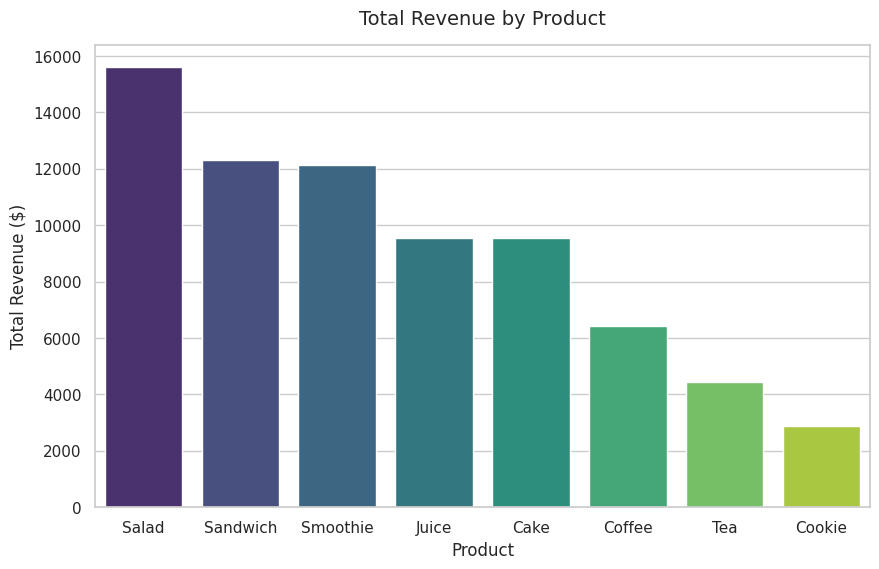
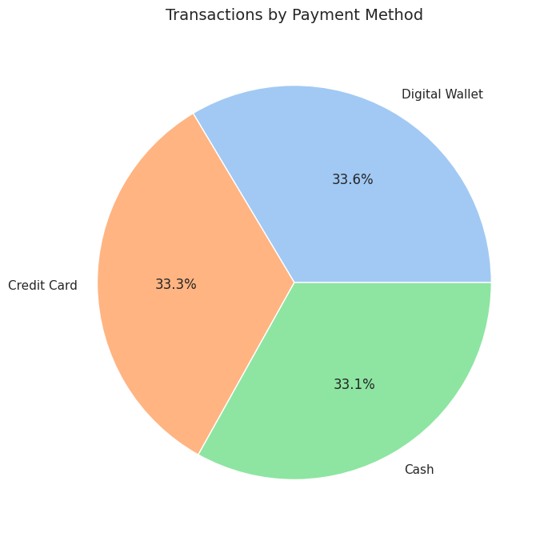
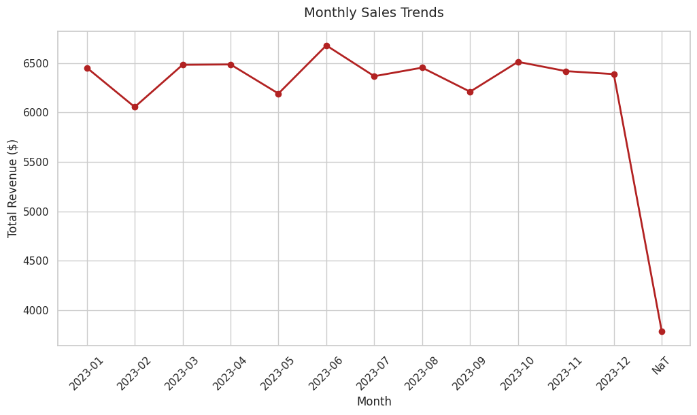

# Automated POS Data Cleaning & ETL Pipeline ☕

## Overview
This repository contains an automated Python-based ETL (Extract, Transform, Load) pipeline designed to audit, clean, and normalize messy point-of-sale (POS) transaction data. The script processes raw retail data, rectifies systemic errors, and loads a clean, structured dataset into a relational database for downstream analytics.

## The Problem: Messy Data
The original dataset (`dirty-cafe-sales-csv (2).csv`) contained 10,000 records of cafe sales with several data integrity issues:
*   **Systemic Text Anomalies:** The presence of literal string flags like `"ERROR"`, `"UNKNOWN"`, and `"NaN"` embedded within numeric and categorical columns.
*   **Calculation Corruptions:** The `Total Spent` column contained missing or mathematically incorrect values.
*   **Data Type Inconsistencies:** Numeric fields (`Quantity`, `Price Per Unit`) were stored as mixed-type strings, preventing aggregation.
*   **Unstandardized Dates:** Inconsistent formatting and invalid strings in the `Transaction Date` column.

## The Solution: Pipeline Architecture
The pipeline (`ecommerce_etl_pipeline.py`) utilizes **Python (Pandas, NumPy)** and **SQLite** to execute the following automated steps:

### 1. Extraction
*   Ingests the raw `.csv` file into a Pandas DataFrame via a command-line argument for modular execution.

### 2. Transformation (Data Cleaning)
*   **Standardization:** Scans the entire dataset and replaces system-generated error strings (`ERROR`, `UNKNOWN`) with proper database-native Null/NaN values.
*   **Type Casting & Coercion:** Forces the `Quantity` and `Price Per Unit` columns into strict numeric data types.
*   **Metric Recalculation:** Rebuilds the `Total Spent` column from scratch by multiplying `Quantity` × `Price Per Unit` to guarantee 100% mathematical accuracy.
*   **Date Normalization:** Parses and casts the `Transaction Date` column into standard `YYYY-MM-DD HH:MM:SS` datetime objects.

### 3. Loading
*   Connects to a local **SQLite** database (`ecommerce_data.db`).
*   Ingests the 10,000 fully validated and cleaned rows into a new table named `cafe_sales`.

---

## 📊 Data Visualizations (Built from Cleaned Data)

By automating the data cleaning pipeline, we are now able to generate reliable business intelligence. Below are key insights derived from the fully validated `cafe_sales` database table.

### 1. Total Revenue by Product Category
The cleaning pipeline ensured that price and quantity metrics were standardized, and missing "Total Spent" calculations were rectified, enabling an accurate revenue breakdown by item.

### 2. Transaction Volume by Payment Method
System-generated "UNKNOWN" and "ERROR" flags in the payment field were converted to proper database-native Null values, providing a clean count of used payment methods.

### 3. Monthly Sales Trends
The `Transaction Date` column was normalized into standard datetime objects, which allows for reliable time-series analysis and the identification of seasonal trends.

